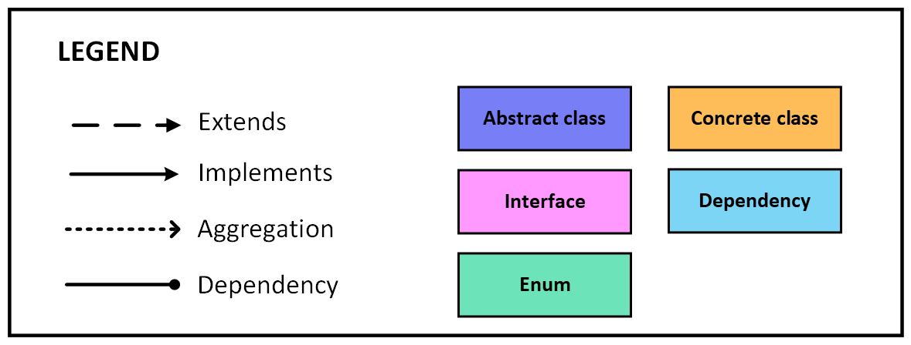
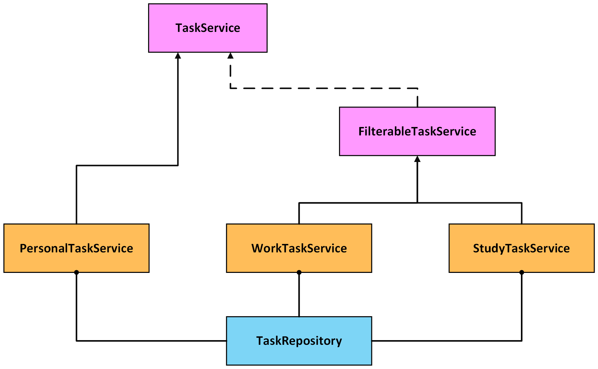
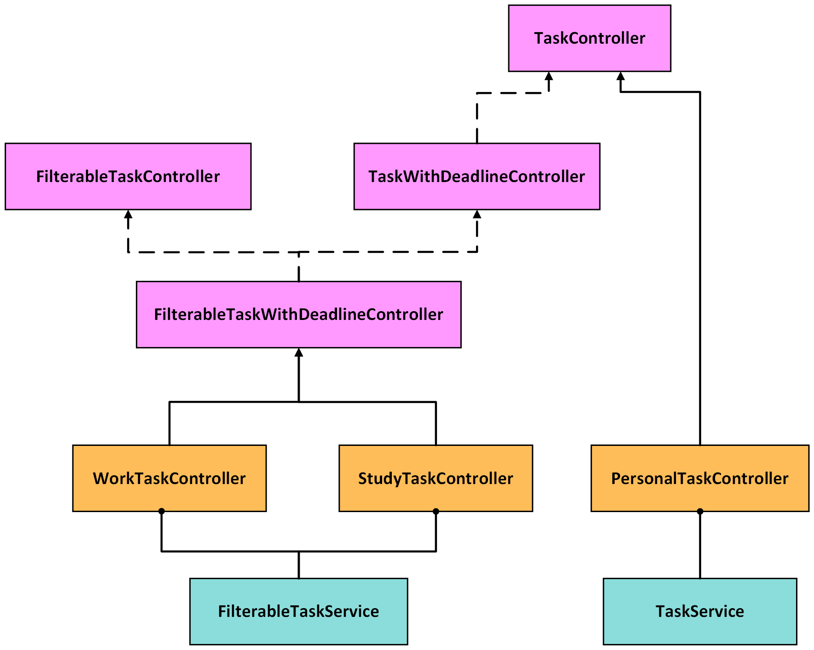
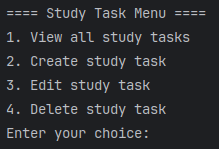

# AdaTask
Task Management Console App

## Table of Contents
- [Overview](#overview)
- [Features](#features)
- [Technical Implementation](#technical-implementation)
	- [Project Structure](#21-project-structure)
	- [Application Flow](#22-application-flow)
	- [Additional Considerations](#23-additional-considerations)
- [Usage](#usage)
- [Dependencies](#dependencies)
- [Contributing](#contributing)
- [License](#license)

## Overview

AdaTask is a simple console application for managing tasks. It allows users to create, edit, delete, and view personal, work and study tasks.

## Features

- **Task Creation**: Add new tasks with details such as title, description, deadline, etc.
- **Task Editing**: Update details of existing tasks
- **Task Removal**: Delete existing tasks.
- **Task Viewing**: List all tasks or filter by specific criteria.

## Technical Implementation

### Project Structure

AdaTask follows a layered architecture design pattern, organizing its components into distinct layers: Domain, Repository, Service, and Controller.

#### Domain Layer: 

Defines the structure and business rules for tasks. 

- **Contracts:**
	- `BaseTask`: Base entity containing common attributes.
	
	- `TaskWithDeadline`: Abstract class extending `BaseTask` for tasks with a deadline. It introduces the _deadline_ attribute, allowing tasks to have a specific date by which they need to be completed.
	
	- `FilterableTask`: Interface defining tasks that can be filtered based on specific criteria.
	
	

	
#### Repository Layer: 

Manages data storage using in-memory lists for simplicity.

- **Contracts:**
	- `TaskRepository`: Interface to provide methods for basic CRUD operations (Create, Read, Update, Delete) on tasks. This interface is designed to handle various task types through generics.

#### Service Layer: 

Implements application logic, including operations for task manipulation. Interacts with the Repository layer to perform data operations and serves as an intermediary between the Controller and Repository layers.

- **Contracts:**
	- `TaskService`: Interface for basic CRUD operations on tasks.
	
	- `FilterableTaskService`: Extends TaskService interface and defines the contract for services that support filtering tasks based on specific criteria. 

#### Controller Layer: 

Manages user interaction via the console. Task-specific controllers process user input, execute corresponding actions, and display results in the console. They interact with the Service layer to perform tasks like creating, editing, deleting, and viewing tasks. Each controller is designed to handle a specific task type.

- **Contracts:**: 
	- `TaskController`: Interface that provides methods for basic task operations such as creating, deleting, editing, and displaying tasks. It also includes a method for running the task-specific menu.

	- `TaskWithDeadlineController`: Interface extending TaskController, specifically for tasks with deadlines. It includes methods for handling deadline-related operations.

	- `FilterableTaskController`: Interface for controllers that support task filtering based on specific criteria.

	- `FilterableTaskWithDeadlineController`: Extends TaskWithDeadlineController and FilterableTaskController, combining functionality for tasks with deadlines and filtering capabilities.

Additionally, the application includes the `MainController` class, which acts as the central hub for user interaction and task management. The MainController manages the flow of the application, displaying the main menu and delegating control to specific task controllers.

These layers ensure a separation of concerns and promote modularity, making the codebase easier to maintain and extend.

### Application Flow

- The application flow starts with the `MainController`, which displays the main menu and redirects to the corresponding task controller based on user input.
- Each task controller interacts with the user to perform operations on tasks by invoking methods from the corresponding service layer.

    
### Additional Considerations

- The project adheres to SOLID principles for clean and extensible design.

- Demonstrates the application of inheritance and generics in data structures and task manipulation operations.

## Usage

1. Ensure you have [IntelliJ IDEA](https://www.jetbrains.com/idea/) installed on your system. Open the project in IntelliJ and run the application by executing the `MainController` class. 

2. Upon running the application, you will be presented with a menu to select the task category (personal, study, or work).

 
3. Choose an option to view tasks, create a new task, edit an existing task, or delete a task.
Follow the on-screen instructions to perform the desired operation.

	
	
	

## Dependencies 

The project does not have any external dependencies.

## Contributing

If you'd like to contribute to AdaTask, please fork the repository, create a new branch, make your changes, and submit a pull request.

## License

This project is licensed under the [MIT License](LICENSE).

